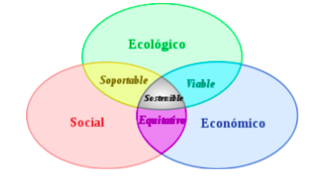
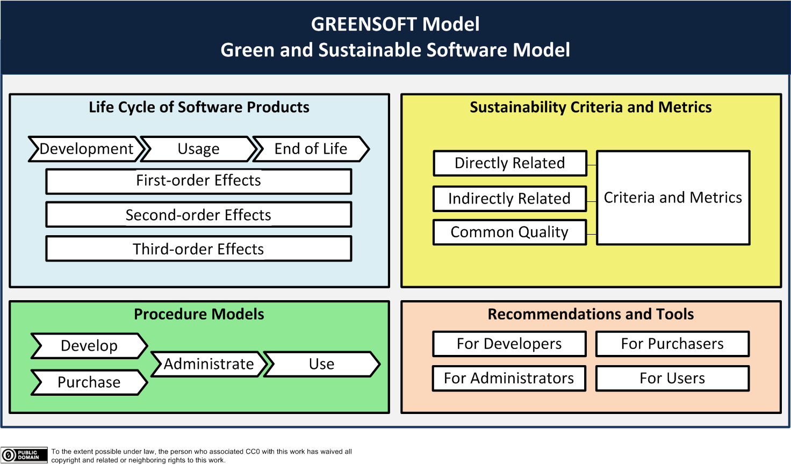
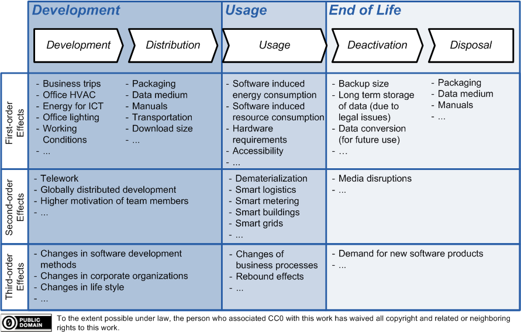
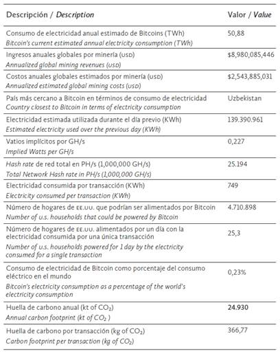
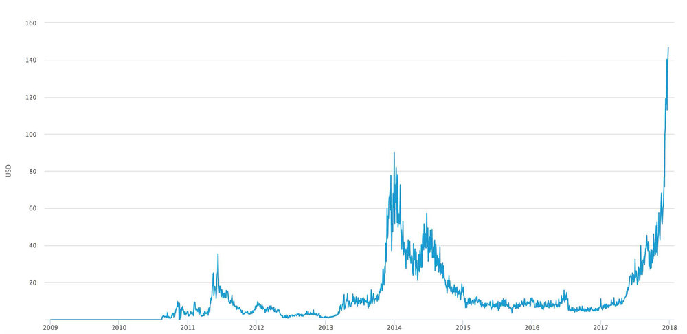
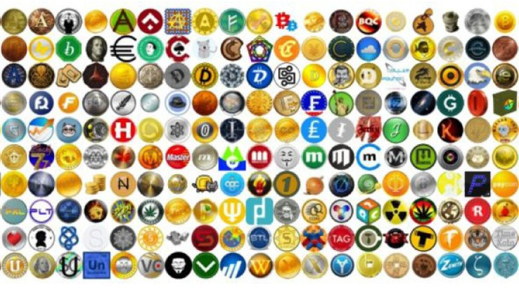

## Ejemplos de Ciclo de Vida de Green Software

APU. Mateo Durante <mdurante@linti.unlp.edu.ar>


<!-- .element style="width:20%;margin:5%;vertical-align:bottom" -->

---
   
## Repaso de definiciones

----

## Green Software
<!-- .slide: style="font-size: 30px;"> -->  
1. Software dirigido a gestionar recursos de ordenador/servidor (como sistemas operativos, compiladores, herramientas de ayuda al desarrollo de software, gestionar HW).
2. Software específicamente construido para gestionar dispositivos a nivel de aplicación (ejemplo TIC para transporte o TIC para gestión de dispositivos de distribución de energía eléctrica o utilización de sensores).
3. Software que directamente o indirectamente apoyan al medio ambiente (ejemplo  juego educativo, etc.).
4. Software diseñado con conciencia verde, técnicas de eco-diseño y eco-eficiencia (para todo desarrollo).

----

## “Green IT” vs “Green by IT”

- “Green by IT” (Green through IT) cubre el apoyo del desarrollo sostenible por medio de las TIC. Por ejemplo, un software que reduce los problemas ambientales a través de la optimización.
- “Green IT” (Green in IT) indica las acciones a través del cual las TIC en sí mismas podrían ser más sostenibles. Esto se refiere a la estrecha relación de hardware y software.

----

## Desarrollo Sostenible

"El desarrollo sostenible es el desarrollo que satisface las necesidades del presente sin comprometer la habilidad de generaciones futuras de satisfacer sus propias necesidades"<!-- .element: style="font-style: italic;" -->

<br>

Definición de la Comisión Mundial sobre el Medio Ambiente y el Desarrollo de la ONU<!-- .element: style="font-size: 25px;" -->

----

## Pilares del desarrollo sostenible



----

### Problema actual advertido en informe de la ONU

<br>

https://news.un.org/es/story/2018/10/1443222


----

## Software Verde y Sostenible
<!-- .slide: style="font-size: 30px;"> -->  

Es el software que:
- Tiene un efecto positivo sobre el desarrollo sostenible.
- Genera directa o indirectamente un impacto negativo mínimo sobre la economía, la sociedad, los seres humanos y el medio ambiente, como resultado de su desarrollo, implementación, uso y disposición final.

Se basa en la Normas:
- ISO 12207 (“Procesos del ciclo de vida del software")
- ISO 14040 ("Evaluación del ciclo de vida")

---

# Ciclo de vida de "Software verde"

## Caso de ejemplo: La criptomoneda Bitcoin Green 

----

## Criptomoneda y Blockchain
<!-- .slide: style="font-size: 30px;"> -->  

- Criptomoneda: es un medio digital de intercambio que utiliza criptografía fuerte para asegurar las transacciones financieras, controlar la creación de unidades adicionales y verificar la transferencia de activos.
- Blockchain: es una estructura de datos en la que la información contenida se agrupa en conjuntos (bloques) a los que se les añade metainformaciones relativas a otro bloque de la cadena anterior en una línea temporal, de manera que gracias a técnicas criptográficas, la información contenida en un bloque solo puede ser repudiada o editada modificando todos los bloques posteriores.

----

## Características de Blockchains

- Almacenamiento de datos: se logra mediante la replicación de la información de la cadena de bloques
- Transmisión de datos: se logra mediante redes de pares
- Confirmación de datos: se logra mediante un proceso de "consenso" entre los nodos participantes. El tipo de algoritmo más utilizado es el de "prueba de trabajo" en el que hay un proceso abierto competitivo y transparente de validación de las nuevas entradas llamada minería

----

## ¿Qué es el Bitcoin?

  - Es un protocolo
  - Red P2P
  - Sistema de pago y mercancía
  - Se utiliza como criptomoneda
  - Utiliza el como algoritmo de consenso a PoW

----

## Algoritmo Prueba de Trabajo

- Busca evitar comportamientos indeseados
- El cliente del servicio realiza algún tipo de trabajo
- Es verificado fácilmente en la parte del servidor
- Normalmente el trabajo consiste en realizar un cómputo en el ordenador del cliente


----
<!-- .slide: style="font-size: 30px;"> -->  

## Caso real: Megabigpower minero en Washington

- 10 TH/seg hacen 1 bitcoin por día en la dificultad actual
- Un hardware especializado utiliza un vatio por GH/seg
- Se necesitan equipos de 10kW para calcular 10TH
- Utiliza equipos que en total consumen 10kW durante todo un dia para extraer 1 bitcoin
- Osea, sus equipos consumen 240 kWh para extraer 1 bitcoin
- 1 MW/h de electricidad de red produce 351kg de carbono (Greenhouse gas emissions by UK)

https://es.bitcoinonair.com/what-is-carbon-footprint-of-bitcoin<!-- .element: style="font-size: 25px;" -->

https://www.ceroco2.org/calculadoras/electrico<!-- .element: style="font-size: 25px;" -->

----

## Caso real: Megabigpower minero en Washington

Conclusiones:
```console
- 240 kWh son el 24% de 1MW/h, entonces..
- Aprox. 85kg de dióxido de carbono en el aire por bitcoin
- Equivale a quemar 30 litros de nafta por bitcoin
- Un auto promedio anda 12km por lt de nafta
- Viajar en auto promedio son 360km por bitcoin
```

La red produce 150 bitcoins por hora
- Viajar en auto promedio 54000km por hora


----

### Problemas desde la perspectiva del Modelo Green

ISO 12207 (“Procesos del ciclo de vida del software")
ISO 14040 ("Evaluación del ciclo de vida")

----

## Modelo GreenSoft




----


### Ciclo de vida de software verde




----

## Desarrollo

- Hardware de proposito general consumido con este fin
- ASIC (Aplication Specific Integrated Circuit)
- Descarga y puesta en marcha
- Manuales
- Dificultad de Aprendizaje
- Comunicaciones remotas
- Cambios en otros desarrollos y organizaciones

----

## Uso

- Alto consumo energético!
- Consumo de recursos generales de hardware
- Requerimientos de Hardware
- Accesibilidad
- Comunicaciones
- Desmaterialización de productos existentes
- Cambios del proceso de negocio (Ej Coinhive)
- Demanda de nuevos productos de software

----

## Final de vida

- Datos persistentes utilizados
- Desechos de Hardware
- Inestabilidad

----



https://scielo.conicyt.cl/scielo.php?script=sci_arttext&pid=S0717-69962018000100032<!-- .element: style="font-size: 25px;" -->

----

## Otros algoritmos de Consenso

- Prueba de Trabajo (PoW)
- Prueba de Participación (PoS)
- Prueba de Participación Delegada (DPoS)
- Prueba de Importancia (PoI)
- Multifirma / Tolerancia a Faltas Bizantinas (BFT)
- Acuerdo Bizantino Federado (FBA)

----

## Bitcoin Green

  - Es una criptomoneda
  - Fue diseñada como sustentable
  - A diferencia del bitcoin utiliza un algoritmo de consenso de Prueba de Participación

https://www.savebitcoin.io/

----

## ¿Por qué el diseño es distinto?



https://www.savebitcoin.io/whitepaper/<!-- .element: style="font-size: 25px;" -->

----

## Desarrollo: comparación

- Descarga y puesta en marcha
- Dificultad de aprendizaje similar
- Comunicaciones remotas

----

## Uso: comparación

- Accesibilidad
- Comunicaciones
- Desmaterialización de productos existentes
- Cambios del proceso de negocio (Ej Coinhive)
- Demanda de nuevos productos de software

----

## Final de vida: comparación

- Datos persistentes utilizados
- Inestabilidad


----

### Criptomonedas: Más de 1300



https://www.finder.com.au/cryptocurrency-list-all


----

¿Ideas?
- Por ej. buscar la generación de estándares en IETF o ITU para resolver el mismo problema

¿Preguntas?
