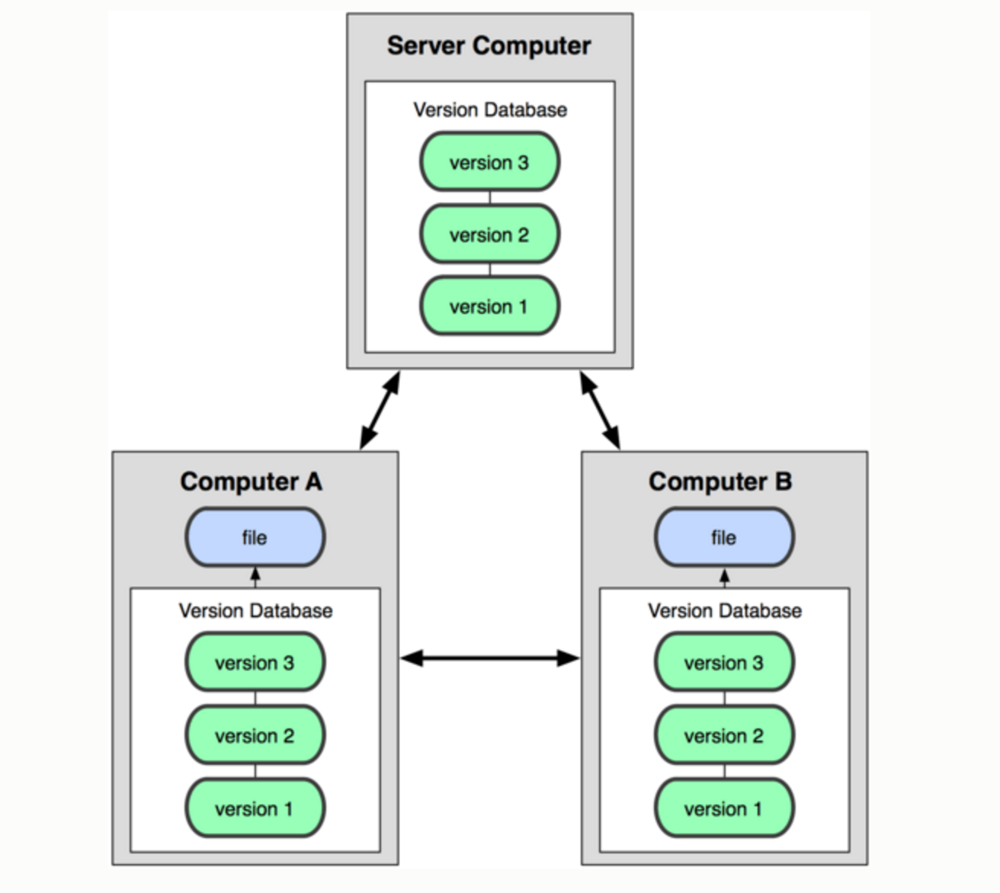
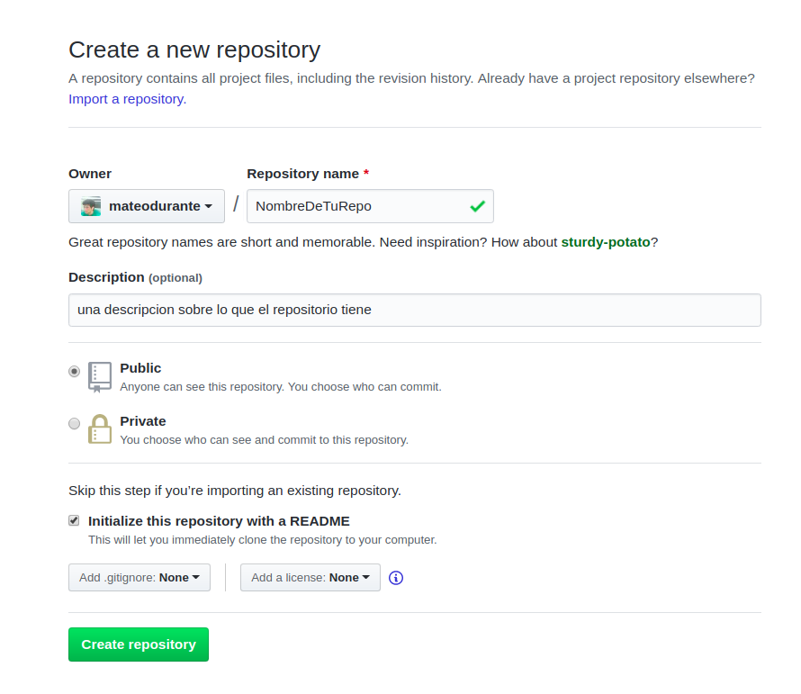
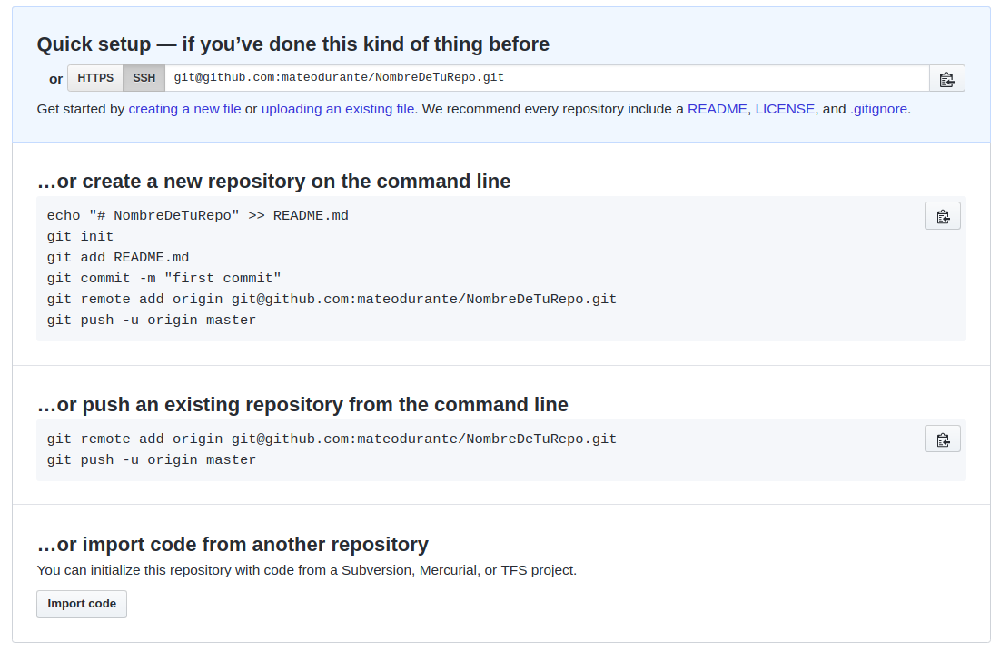
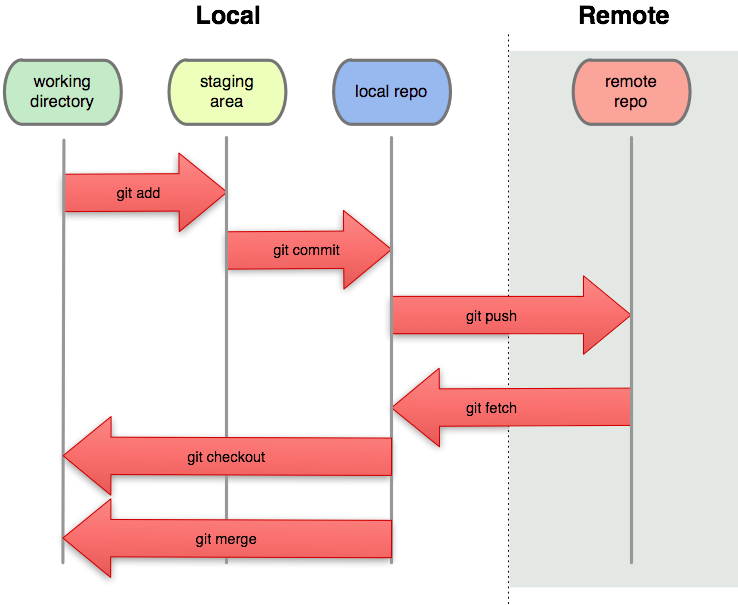

## Explicación práctica - Git/Github


<!-- .element style="width:20%;margin:5%;vertical-align:bottom" -->
<!-- .element style="width:20%;margin:5%;vertical-align:bottom" -->

----

## ¿Para qué sirve Git?

“El control de versiones es un sistema que registra los cambios realizados sobre un archivo o conjunto de archivos a lo largo del tiempo, de modo que puedas recuperar versiones específicas más adelante.”<!-- .element: style="font-style: italic;" -->

https://git-scm.com/book/es/v1/Empezando-Acerca-del-control-de-versiones


----

#### Sistema de control de versiones distribuido




----

## [Github](https://github.com/)
<!-- .slide: style="font-size: 35px;"> -->  

Github es una aplicación opensource que nos permite administrar repositorios en git mediante una interfaz web.
- Perfil
- Repositorios propios (públicos o privados).
- **Generación y configuración de clave [SSH](https://help.github.com/en/articles/connecting-to-github-with-ssh)**
- Red social de desarrolladores/as.
- Una [pagina web](https://pages.github.com/) por proyecto.
- Toda la [ayuda](https://help.github.com/en#dotcom) de Github.


----

## Usando clave SSH

- Agregar la clave SSH es para toda la plataforma de Git.
- Sirve para que el servidor te reconozca y no pida usuario y contraseña cada en cada push.
- **Nunca cargar en tu cuenta personal la clave pública de una PC que es compartida** ya que cualquiera podría modificar en tu nombre.


----

## Agregar clave SSH

1. Crearla (si no la han creado ya):

    ```bash
    $ ssh-keygen -t rsa
    ```

    Con esto se han creado las claves pública y privada. Las clave privada nunca debe ser compartida. La clave privada te identifica frente a otros dispositivos.

2. Copiar la clave pública al servidor Github. Ésta se ubica en el archivo ~/.ssh/id_rsa.pub

    ```bash
    $ cat ~/.ssh/id_rsa.pub
    ```

----

#### Opciones al crear un nuevo repositorio




----

#### Opciones al crear un nuevo repositorio



---

# Practica!

## Crearemos un repo y trabajaremos en simultaneo desde 2 PC

----

## Inicialización en “computer A”: Opcion 1
<!-- .slide: style="font-size: 30px;"> -->  

```bash
A@pcA$ mkdir python1
A@pcA$ cd python1
A@pcA$ git init
A@pcA$ git remote add origin https://github.com/minuevorepo.git 
```

\# Creamos una carpeta, inicializamos y le decimos a git cuál es su servidor-proyecto<!-- .element style="margin:5%;vertical-align:bottom" -->

----

## Inicialización en “computer A”: Opcion 2

```bash
A@pcA$ mkdir python1
A@pcA$ cd python1
A@pcA$ git init
A@pcA$ touch README.md
A@pcA$ git add README.md
A@pcA$ git status
```
\# Creamos el archivo README.md y lo agregamos, esto lo pone en área “Staging”<!-- .element style="margin:5%;vertical-align:bottom" -->


----

## Inicialización en “computer A”: Opcion 3

```bash
A@pcA$ mkdir python1
A@pcA$ cd python1
A@pcA$ git init
A@pcA$ touch README.md
A@pcA$ git add README.md
A@pcA$ git status
A@pcA$ git commit –m 'Primer commit'
A@pcA$ git log
A@pcA$ git push origin master
```
\# Los “commiteamos”, o sea, quedan listos para subir y “pusheamos”, subimos los cambios a la rama master<!-- .element style="vertical-align:bottom" -->


----

#### Workflow realizado hasta ahora




<!-- ----

#### ¿Qué sigue?


 -->


----

## ¿Qué hacemos en “computer B”?

```bash
B@pcB$ git clone https://github.com/minuevorepo.git
B@pcB$ echo “Hola mundo” >> README.md
B@pcB$ git add .
B@pcB$ git commit “cambio en readme”
B@pcB$ git push origin master
```
\# Clonamos el proyecto desde el servidor, editamos el readme, add, commit, push<!-- .element style="vertical-align:bottom" -->


----

## Seguimos trabajando y recibimos los cambios en A

```bash
A@pcA$ echo Chau mundo” >> README.md
A@pcA$ git commit -m “nuevos cambios”
A@pcA$ git pull
```
\# Actualizamos el repositorio (git fetch + git merge = git pull)<!-- .element style="vertical-align:bottom" -->


----

# CONFLICTO!

```bash
! [rejected] master -> master (fetch first)
```
\# Y AHORA!?<!-- .element style="vertical-align:bottom" -->


----

## Resolvemos los conflictos en A

```bash
A@pcA$ echo “Otra cosa” >> README.md
A@pcA$ git commit -m “nuevos cambios”
A@pcA$ git pull
A@pcA$ git status
En la rama master
Your branch and 'origin/master' have diverged,
and have 1 and 1 different commit each, respectively.
  (use "git pull" to merge the remote branch into yours)
nothing to commit, working directory clean
```
\# Vemos un nuevo estado<!-- .element style="vertical-align:bottom" -->

----

## Resolvemos los conflictos en A

```bash
# editamos el archivo como queremos que quede
A@pcA$ git add README.md
A@pcA$ git commit # Sin mensaje
A@pcA$ git push origin master
```
\# Una vez resuelto: add, commit, push<!-- .element style="vertical-align:bottom" -->


---

### Siempre va a ser así de complicado?

----

# NO!


----

### ¿Por qué los conflicos?

Depende cuán bien se maneje el sistema de ramas (branches) del proyecto. Considerar que siempre que se trabaje sobre el mismo archivo al mismo momento existirán conflictos, por ende, hay que coordinar bien la división de tareas y modularizar al máximo el código.

----

### ¿Por qué los conflicos?
<!-- .slide: style="font-size: 35px;"> -->  

Lo ideal sería tener las ramas:

- ***master***: sólo existe acá lo que sí funciona y únicamente se puede hacer merge desde develop (nadie pushea acá).
- ***develop***: es la primera rama que debería crearse y de acá se desprenden las siguientes. En esta rama nadie debería pushear, se hacen merge desde “feature-*” (nuevas funcionalidades) o “fix-*” (reparar una funcionalidad previamente creada).
- ***feature-* ***: ésta, al igual que “fix-*”, son creadas a partir de develop y dependen de un “issue”, donde puede trabajar una o más personas respecto a una funcionalidad o bug específico, evitando influir así en el resto de los desarrolladores.

----

## Para finalizar

En git existe un archivo muy importante que en proyectos grandes siempre se usa:


**.gitignore**

----

## .gitignore

Es un archivo de texto en el que se agregan carpetas y archivos que no querramos que *git* los 'trackee', es decir, que no los suba ni baje del repositorio. Por ejemplo: 
* Archivos de configuracion (Base de datos, editor de texto)
* Dependencias (PySimpleGUI, pattern, etc)
* Mas cosas que no querramos

----

### Links de interés

* [Listado de comandos](https://github.github.com/training-kit/downloads/es_ES/github-git-cheat-sheet.pdf)
* [Github guides](https://guides.github.com/introduction/git-handbook/)
* [Una guía sencilla de git](https://rogerdudler.github.io/git-guide/index.es.html)
* [Libro: Pro git](https://git-scm.com/book/es/v2)